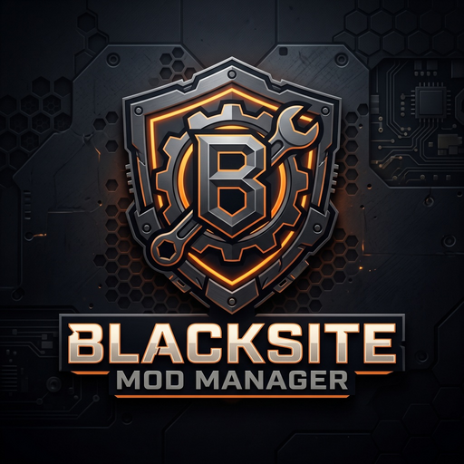

<div align="center">



# Blacksite Mod Manager

**Next-generation mod manager, conflict resolver, and server orchestrator for Single Player Tarkov (SPT) and Fika.**

[](https://github.com/Manpig01/Blacksite_Mod_Manager-TEST/releases)
[](https://github.com/Manpig01/Blacksite_Mod_Manager-TEST/actions)
[](https://sp-mod.com)
[](https://github.com/project-fika)
[](LICENSE)
[](https://github.com/Manpig01/Blacksite_Mod_Manager-TEST/releases)

<p align="center">
  <a href="#-quick-download">Download</a> •
  <a href="#-features">Features</a> •
  <a href="#-installation--setup">Setup</a> •
  <a href="#-architecture">Architecture</a> •
  <a href="#-development">Development</a> •
  <a href="#-license">License</a>
</p>

</div>

---

## ⚡ Highlights in v2.0.0

- **🚀 1-Click Batch Mod Updater**: Automatically discovers updates for all installed mods and upgrades them in a single queued batch with automatic `.json`/`.cfg` configuration backup and preservation.
- **🛡️ Deep Clean Uninstaller**: Purges both directory-based and standalone BepInEx client plugins and server mods with zero orphan files, while strictly safeguarding SPT core system files (`spt/`).
- **⚔️ Real-Time Mod Conflict Detection**: Automatically flags duplicate client DLLs and server package ID collisions with immediate one-click resolution actions.
- **📁 SPT 4.x & Legacy Layout Engine**: Seamlessly maps mods into `SPT_Runtime/user/mods`, `BepInEx/plugins`, and game root overlays with zero manual configuration.
- **🎮 Integrated Server & Game Launcher**: Monitors the SPT server console output stream and automatically chains client startup with double-launch guard.
- **⚙️ In-App Mod Config Editor**: Live syntax editor for `.json`, `.jsonc`, `.cfg`, and `.yaml` config files with automatic backup rotation and syntax verification.

---

## 📦 Quick Download

Head over to the **[Latest GitHub Release](https://github.com/Manpig01/Blacksite_Mod_Manager-TEST/releases/latest)** to grab the Windows desktop binaries:

| Package | File | Description |
| :--- | :--- | :--- |
| **Setup Installer** *(Recommended)* | `Blacksite-Mod-Manager-Setup-2.0.0.exe` | Full Windows installer with Start Menu integration, desktop shortcut, and uninstaller. |
| **Setup Installer (ZIP)** | `Blacksite-Mod-Manager-Setup-2.0.0.zip` | Standalone ZIP archive containing solely `Blacksite-Mod-Manager-Setup-2.0.0.exe` for environments with .exe download restrictions. |
| **Portable Standalone** | `Blacksite-Mod-Manager-Portable-2.0.0.exe` | Zero-installation executable. Run directly from any folder or USB drive. |
| **Integrity Checksums** | `SHA256SUMS.txt` | Cryptographic SHA256 hashes for all release artifacts. |

---

## ✨ Features

### 1. Catalog Browser & Live Forge Sync
- Direct, real-time integration with the **[sp-mod.com](https://sp-mod.com)** Forge API.
- Filter by Category, SPT version target, author tag (`@Author`), and Fika compatibility.
- Sort by downloads, rating, update date, and name.
- Offline fixture fallback caching ensures the catalog remains responsive even without an active internet connection.

### 2. Tactical Operator UI
- Designed with high-contrast tactical dark aesthetics (`#121418` dark carbon theme, `#EA580C` hazard orange accents).
- High-performance virtualized 3-column mod grid with crisp thumbnails, author badges, and status pills.
- Custom borderless titlebar with native Windows minimize, maximize, and close controls.

### 3. Installed Mod Management
- Automatic disk synchronization for installed client plugins and server mods.
- One-click mod enable/disable toggling using atomic `.disabled` staging.
- Clean individual mod uninstall and bulk purge.

### 4. Named Mod Profiles
- Create, duplicate, and switch mod loadouts (e.g. *Vanilla+ Minimal*, *Fika Co-op Sync*, *Hardcore Realism*).
- Instant profile activation with zero manual folder renaming.

### 5. Diagnostics & Modpack Export
- One-click export of installed mod manifests to JSON for modpack creators or bug reporting.
- Diagnostic bundle export detailing SPT directory structure, detected versions, and installed plugins.

---

## 🛠️ Architecture & Layout Routing

Blacksite automatically inspects your SPT installation and safely routes mod files based on layout conventions:

```
<SPT Root Directory>
│
├── BepInEx/
│   └── plugins/
│       ├── spt/                 <-- Protected SPT core system (Never touched)
│       ├── DrakiaXYZ-Waypoints/ <-- Folder-based client mod (Managed)
│       └── ExampleMod.dll       <-- Standalone client DLL (Managed)
│
├── SPT_Runtime/                 <-- SPT 4.x Modern Layout
│   └── user/
│       └── mods/
│           └── ServerMod-1/     <-- Server-side mods
│
├── user/                        <-- Legacy SPT Layout Fallback
│   └── mods/
│
└── EscapeFromTarkov_Data/       <-- Game data overlays
```

---

## 💻 Development & Building from Source

### Prerequisites
- [Node.js](https://nodejs.org/) v20+ or v22+
- npm v10+

### Setup

```bash
# Clone the repository
git clone https://github.com/Manpig01/Blacksite_Mod_Manager-TEST.git
cd Blacksite_Mod_Manager-TEST

# Install dependencies
npm install

# Start development dev server
npm run dev
```

### Production Build

```bash
# Type check and compile web bundle
npm run build

# Package Windows desktop executables (installer & portable)
npm run package:win
```

Output binaries will be generated inside the `./release/` directory.

---

## 🤝 Contributing

Contributions from the SPT community are welcome!
1. Fork the repository.
2. Create your feature branch (`git checkout -b feature/tactical-feature`).
3. Commit your changes (`git commit -m 'Add tactical feature'`).
4. Ensure tests and lint pass (`npm run lint && npm run build`).
5. Open a Pull Request using our [PR Template](.github/pull_request_template.md).

---

## 📄 License

Blacksite Mod Manager is open-source software licensed under the **[MIT License](LICENSE)**.
Single Player Tushonka (SPT) is an independent community project and is not affiliated with Battlestate Games.
